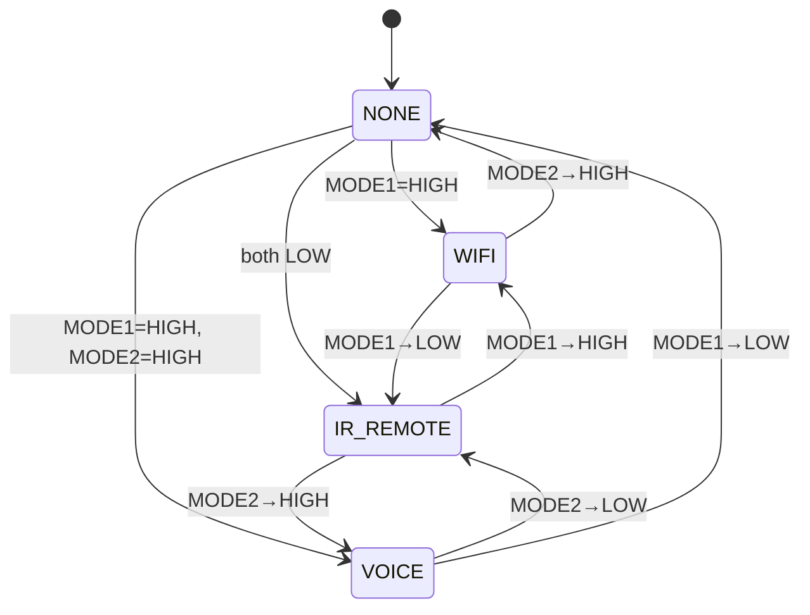
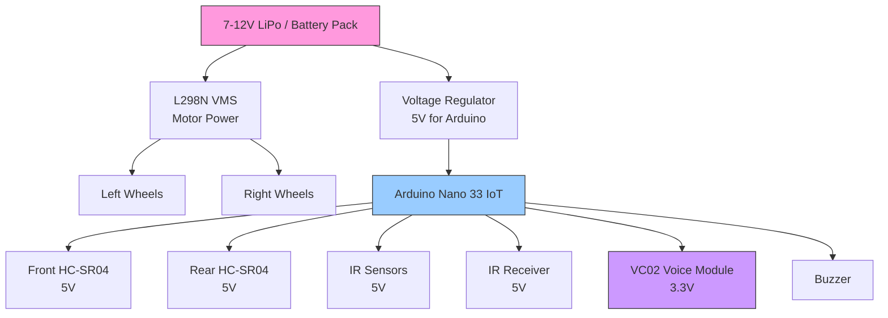
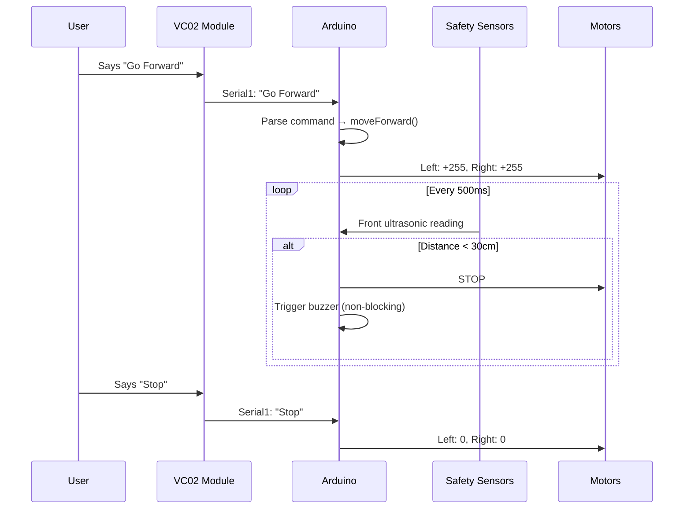

# RC Car — Complete Hardware Design Document

## System Overview

WiFi-controlled RC car with **4 input modes** (WiFi, IR Remote, Voice, None), obstacle avoidance, and floor-drop protection.

```mermaid
graph TB
    subgraph Inputs["INPUT MODULES"]
        A1[WiFi Web UI<br/>Browser on Phone/PC]
        A2[IR Remote<br/>TV-style remote]
        A3[VC02 Voice Module<br/>AI Thinker]
    end

    subgraph Controller["Arduino Nano 33 IoT"]
        subgraph Modes["Mode Selection<br/>(2-pin switch)"]
            M[MODE_PIN_1 → A0<br/>MODE_PIN_2 → A1]
        end

        subgraph MotorCtrl["Motor Driver Control"]
            P1["Pin 5 PWM → ENA"]
            P2["Pin 6 PWM → ENB"]
            P3["Pin 7 → IN1"]
            P4["Pin 12 → IN2"]
            P5["Pin 13 → IN3"]
            P6["Pin 10 → IN4"]
        end

        subgraph Safety["Safety Sensors"]
            US1[Front Ultrasonic<br/>Trig:3 / Echo:4]
            US2[Rear Ultrasonic<br/>Trig:11 / Echo:A3]
            IR1[Front IR Drop → A4]
            IR2[Rear IR Drop → A5]
        end

        subgraph Actuation["Actuators"]
            BUZ[Buzzer → A2]
        end

        LOGIC[Command Logic<br/>loop()]
    end

    subgraph Output["OUTPUT"]
        MD[L298N Motor Driver]
        WL[Left Wheels]
        WR[Right Wheels]
    end

    A1 -->|WiFi AP:80| LOGIC
    A2 -->|IR 38kHz| LOGIC
    A3 -->|Serial1 9600| LOGIC
    M --> LOGIC
    US1 --> LOGIC
    US2 --> LOGIC
    IR1 --> LOGIC
    IR2 --> LOGIC
    LOGIC --> BUZ
    LOGIC --> MotorCtrl
    MotorCtrl --> MD
    MD --> WL
    MD --> WR
```

---

## Mode Selection Logic

Two hardware switches (jumper to 3.3V) determine the active input mode.



| MODE_PIN_1 (A0) | MODE_PIN_2 (A1) | Active Mode | Description |
|:---:|:---:|:---:|---|
| HIGH | LOW | **WiFi** | Web UI controls via HTTP on port 80 |
| LOW | LOW | **IR Remote** | Standard IR TV remote |
| HIGH | HIGH | **Voice (VC02)** | Voice commands via VC02 module |
| LOW | HIGH | **None** | Car idle, no input accepted |

---

## Complete Pin Map

### Arduino Nano 33 IoT Pin Assignments

| Pin | Role | Component | Type | Notes |
|:---:|------|-----------|------|-------|
| **2** | IR Receiver Signal | TSOP/VS1838B | INPUT | IR remote receiver |
| **3** | Ultrasonic Trig | Front HC-SR04 | OUTPUT | Obstacle detection (front) |
| **4** | Ultrasonic Echo | Front HC-SR04 | INPUT | — |
| **5** | PWM Enable A | L298N ENA | OUTPUT (PWM) | Left motor speed |
| **6** | PWM Enable B | L298N ENB | OUTPUT (PWM) | Right motor speed |
| **7** | Input 1 | L298N IN1 | OUTPUT | Left motor direction |
| **8** | Serial1 RX | VC02 TX | INPUT (UART) | Voice module receive |
| **9** | Serial1 TX | VC02 RX | OUTPUT (UART) | Voice module transmit |
| **10** | Input 4 | L298N IN4 | OUTPUT | Right motor direction |
| **11** | Ultrasonic Trig | Rear HC-SR04 | OUTPUT | Obstacle detection (rear) |
| **12** | Input 2 | L298N IN2 | OUTPUT | Left motor direction |
| **13** | Input 3 | L298N IN3 | OUTPUT | Right motor direction |
| **A0** | Mode Select 1 | Toggle switch / jumper | INPUT | Pull-down recommended |
| **A1** | Mode Select 2 | Toggle switch / jumper | INPUT | Pull-down recommended |
| **A2** | Buzzer | Passive/Active buzzer | OUTPUT | Active-low (HIGH = OFF) |
| **A3** | Ultrasonic Echo | Rear HC-SR04 | INPUT | — |
| **A4** | IR Floor Sensor | Front IR module | INPUT | Floor drop detection (front) |
| **A5** | IR Floor Sensor | Rear IR module | INPUT | Floor drop detection (rear) |

### VC02 Voice Module (Hardware Serial1)

| VC02 Pin | Arduino Pin | Purpose |
|----------|-------------|---------|
| **VCC** | **3.3V** | Power (3.3V logic) |
| **GND** | **GND** | Common ground |
| **TX** | **D8 (Serial1 RX)** | VC02 → Arduino (receive voice commands) |
| **RX** | **D9 (Serial1 TX)** | Arduino → VC02 (configuration, optional) |

> **Note:** D8 and D9 are freed for `Serial1` since L298N IN2/IN3 were moved to D12/D13. USB Serial debugging (`Serial0` on D0/D1) remains available at 115200 baud even while voice mode is active.

---

## Component Wiring Diagrams

### Motor Driver (L298N)

```mermaid
graph LR
    subgraph Arduino
        P5[Pin 5<br/>PWM]
        P6[Pin 6<br/>PWM]
        P7[Pin 7]
        P12[Pin 12]
        P13[Pin 13]
        P10[Pin 10]
        G_A[5V/GND]
    end

    subgraph L298N
        ENA[ENA]
        ENB[ENB]
        IN1[IN1]
        IN2[IN2]
        IN3[IN3]
        IN4[IN4]
        VM[12V VMS]
        G_L[GND]
        MA[Motor A<br/>OUT1/OUT2]
        MB[Motor B<br/>OUT3/OUT4]
    end

    subgraph Motors
        LM[Left Wheels]
        RM[Right Wheels]
    end

    P5 --> ENA
    P6 --> ENB
    P7 --> IN1
    P12 --> IN2
    P13 --> IN3
    P10 --> IN4
    G_A --> G_L
    VM -.->|7-12V Battery| 
    MA --> LM
    MB --> RM
```

### Ultrasonic Sensors (HC-SR04)

```
Front Sensor (Obstacle ahead):
  VCC  → 5V
  GND  → GND
  TRIG → Pin 3
  ECHO → Pin 4
  Threshold: 30 cm

Rear Sensor (Obstacle behind):
  VCC  → 5V
  GND  → GND
  TRIG → Pin 11
  ECHO → Pin A3
  Threshold: 40 cm
```

### IR Floor Drop Sensors

```
Front IR Module:
  VCC  → 5V
  GND  → GND
  OUT  → A4   (HIGH = edge detected / no floor)

Rear IR Module:
  VCC  → 5V
  GND  → GND
  OUT  → A5   (HIGH = edge detected / no floor)
```

### IR Remote Receiver (TSOP38238 / VS1838B)

```
  VCC  → 5V
  GND  → GND
  OUT  → Pin 2
```

### VC02 Voice Module

```
  VCC  → 3.3V    (do NOT connect to 5V)
  GND  → GND
  TX   → D8 (Serial1 RX)
  RX   → D9 (Serial1 TX)
  Baud: 9600
```

### Buzzer

```
  +  → Pin A2
  -  → GND
  Logic: Active-low (HIGH = OFF, LOW = ON)
```

### Mode Selection Switches

```
  Switch 1 (WiFi/Voice select):
    One side → 3.3V
    Other side → Pin A0
    (Use 10k pull-down resistor to GND if not internal)

  Switch 2 (Voice/None select):
    One side → 3.3V
    Other side → Pin A1
    (Use 10k pull-down resistor to GND if not internal)
```

---

## Power System



> **Important:** All components must share a **common ground**. Connect battery GND → Arduino GND → sensor GND → VC02 GND.

---

## Voice Command Mapping

Program these commands into the VC02 using the VC02 configuration tool (USB-to-serial adapter or Arduino Serial Monitor in setup mode).

| Voice Command (English) | Arduino Action | HTTP Equivalent | Motor Behavior |
|------------------------|----------------|-----------------|----------------|
| `"Go Forward"` | `moveForward()` | `GET /F` | Both motors forward at MAX_SPEED (255) |
| `"Go Back"` | `moveBackward()` | `GET /B` | Both motors backward at MAX_SPEED (255) |
| `"Turn Left"` | `turnLeft()` | `GET /L` | Left motor reverse, right motor forward (500ms, then stop) |
| `"Turn Right"` | `turnRight()` | `GET /R` | Right motor reverse, left motor forward (500ms, then stop) |
| `"Stop"` | `stopMotors()` | `GET /S` | Both motors off |
| `"Rotate Left"` | `rotateLeft()` | `GET /LR` | Continuous left spin at BASE_SPEED (180) |
| `"Rotate Right"` | `rotateRight()` | `GET /RR` | Continuous right spin at BASE_SPEED (180) |
| `"Forward Slow"` | `moveForwardDetect()` | `GET /FD` | Both motors forward at SLOW_SPEED (80) |
| `"Back Slow"` | `moveBackwardDetect()` | `GET /BD` | Both motors backward at SLOW_SPEED (80) |

### VC02 Programming Steps

1. Connect VC02 to a USB-to-TTL adapter (3.3V)
2. Open the VC02 configuration software (or use Arduino with a setup sketch)
3. Add each voice command above as a **custom command**
4. Set the **echo mode** so the VC02 sends back the command text when recognized
5. Set baud rate to **9600**
6. Save and flash to the VC02 module

---

## Data Flow



---

## Loop Execution Flow

```mermaid
flowchart TD
    START[loop()] --> MODE[Check mode pins<br/>every 10s]
    MODE --> TURN[Check turn timer<br/>auto-stop after 500ms]
    TURN --> BUZZ[Check buzzer timer<br/>auto-off after 500ms]
    BUZZ --> FLOOR{Moving?}
    FLOOR -->|Yes| DROP[Check IR floor drop]
    FLOOR -->|No| OBST
    DROP --> OBST{Direction?}
    OBST -->|Forward| CHECKF[Front ultrasonic<br/>every 500ms]
    OBST -->|Backward| CHECKB[Rear ultrasonic<br/>every 500ms]
    OBST -->|Stopped| INPUT[Read input]
    CHECKF --> INPUT
    CHECKB --> INPUT
    INPUT{Mode?}
    INPUT -->|WiFi| HTTP[Handle HTTP client]
    INPUT -->|IR| IRREAD[Read IR remote]
    INPUT -->|Voice| VC02READ[Read VC02 via Serial1]
    INPUT -->|None| END[End loop]
    HTTP --> END
    IRREAD --> END
    VC02READ --> END
    END --> START
```

---

## Bill of Materials (BoM)

| # | Component | Qty | Notes |
|---|-----------|-----|-------|
| 1 | Arduino Nano 33 IoT | 1 | Main controller (WiFi + BLE built-in) |
| 2 | L298N Motor Driver | 1 | Dual H-bridge, 2A per channel |
| 3 | DC Gear Motors + Wheels | 2 | 6-12V, with encoders optional |
| 4 | HC-SR04 Ultrasonic Sensor | 2 | Front + rear obstacle detection |
| 5 | IR Obstacle Avoidance Module | 2 | KY-038 or similar (floor drop) |
| 6 | TSOP38238 IR Receiver | 1 | 38kHz demodulator |
| 7 | VC02 AI Thinker Voice Module | 1 | Voice recognition (UART) |
| 8 | Active Buzzer | 1 | 5V, active-low |
| 9 | Toggle Switches / Jumpers | 2 | Mode selection |
| 10 | 10kΩ Resistors | 2 | Pull-down for mode pins |
| 11 | 7-12V Battery Pack | 1 | LiPo or AA pack with holder |
| 12 | Chassis + Casters | 1 | 2WD or 4WD car kit |
| 13 | Jumper Wires | — | Male-to-male, male-to-female |
| 14 | Breadboard | 1 | Prototyping |

---

## Pin Migration Summary

The following pins were moved to free D8/D9 for `Serial1` (VC02 voice module):

| Component | Old Pin | New Pin | Reason |
|-----------|:---:|:---:|-------|
| L298N IN2 | D8 | **D12** | Freed D8 for Serial1 RX |
| L298N IN3 | D9 | **D13** | Freed D9 for Serial1 TX |
| IR Floor (front) | D12 | **A4** | D12 now used by IN2 |
| IR Floor (rear) | D13 | **A5** | D13 now used by IN3 |
| Mode Select 1 | A4 | **A0** | A4 now used by IR Front |
| Mode Select 2 | A5 | **A1** | A5 now used by IR Rear |

> **Before wiring:** Check this table against your existing connections and update jumpers accordingly.

---

## Safety Notes

1. **VC02 is 3.3V logic** — never power it from 5V
2. **Common ground** — all components must share GND with the Arduino
3. **Motor current** — L298N can overheat; add a heatsink if motors draw >1A
4. **Battery voltage** — do not exceed L298N's 12V max or Arduino's Vin max (12V)
5. **Ultrasonic sensors** — avoid pointing sensors at each other (cross-talk)
6. **IR floor sensors** — calibrate threshold for your surface; dark surfaces may trigger false positives

---

## Troubleshooting Quick Reference

| Symptom | Likely Cause | Fix |
|---------|-------------|-----|
| Car doesn't move in WiFi mode | AP not started / wrong IP | Check Serial Monitor for "AP IP address" |
| Voice commands not recognized | Wrong baud / wiring | Verify 9600 baud on Serial1, TX→RX crossover |
| Motors spin but car goes straight | Motor polarity reversed | Swap left motor wires on L298N |
| False obstacle detection | Sensor cross-talk | Angle sensors outward, add delay between reads |
| Mode flickers | No pull-down resistors | Add 10kΩ pull-down on A0/A1 |
| Buzzer always on | Active-high vs active-low | Invert digitalWrite logic |
